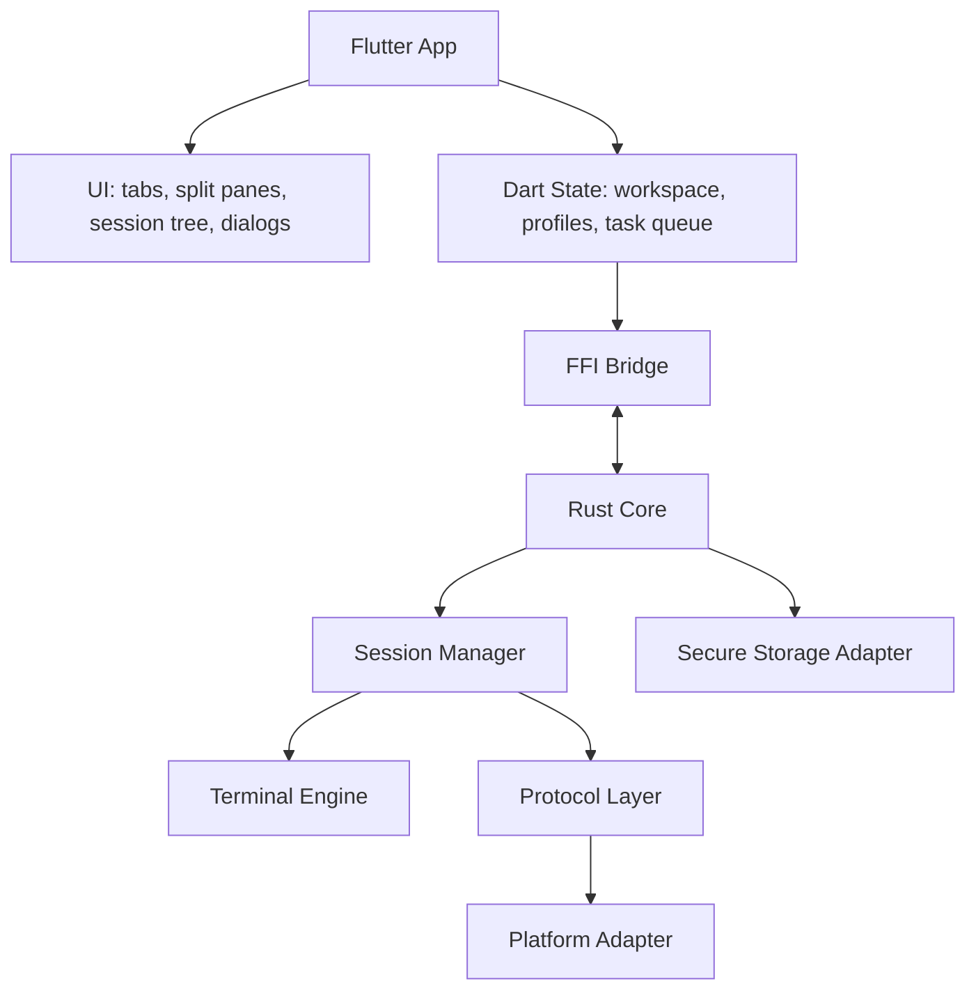
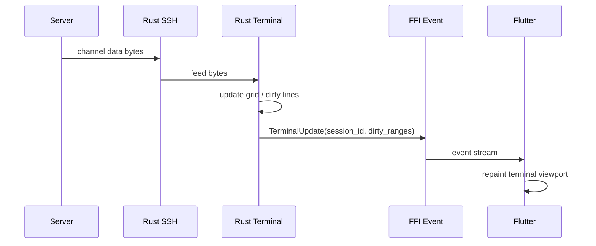
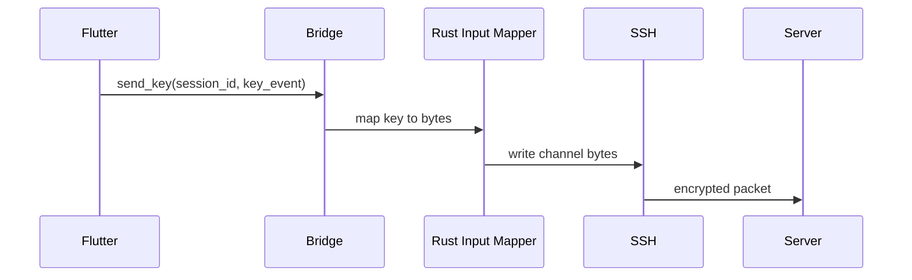

# Flutter + Rust 架构设计

## 架构原则

- Flutter 负责界面、用户交互、窗口布局、会话编排。
- Rust core 负责协议、终端解析、PTY、SFTP、重连、安全敏感逻辑。
- Dart 不直接处理 SSH 协议，不直接解析复杂 ANSI 状态机。
- Rust 不直接依赖 Flutter UI 概念，只暴露命令和事件。
- 所有跨线程事件必须带 `session_id` 或 `task_id`。

## 模块划分



## Flutter 层

职责：

- 窗口、Tab、分屏、侧边栏、状态栏。
- session profile 编辑。
- known_hosts 决策弹窗。
- 密码/passphrase 输入框。
- 终端 viewport 绘制。
- 文件管理器、传输队列展示。
- 设置、主题、快捷键。

不负责：

- SSH packet。
- SFTP packet。
- Telnet IAC parser。
- ANSI/VT 状态机。
- PTY 系统调用。
- 私钥解密细节。

## Rust Core 层

职责：

- session 生命周期。
- SSH/Telnet/Serial/Raw TCP/Shell 协议适配。
- PTY 创建与 resize。
- ANSI/VT parser 和 terminal grid。
- Unicode 宽度与 cell 布局。
- SFTP/SCP。
- keepalive、timeout、重连。
- known_hosts 解析与写入。
- 凭据加密与敏感数据生命周期。

## 数据流

### 远程输出到 Flutter



### 用户输入到远端



## 线程模型

建议：

- Flutter UI thread 只处理 UI。
- Dart isolate 可用于轻量业务，但协议 IO 不放 Dart。
- Rust 使用 async runtime 或专用线程池。
- 每个 session 拥有独立任务或 actor。
- terminal grid 可由 session actor 独占，避免复杂锁。
- Flutter 通过事件订阅获取 dirty ranges，不直接共享 Rust 内存。

可选 runtime：

- `tokio`：适合网络、SFTP、定时器、任务管理。
- 本地 PTY 可以用阻塞线程接入 tokio channel。

## 终端绘制策略

推荐两阶段：

- Phase 1：Rust 输出 viewport cell snapshot，Flutter `CustomPainter` 绘制文本。
- Phase 2：Rust 输出 dirty ranges + glyph atlas 优化，Flutter 只重绘脏行。

Cell 数据建议包含：

- grapheme/text。
- width。
- foreground/background。
- bold/italic/underline/strike。
- inverse。
- cursor。
- selection。
- hyperlink metadata。

## 依赖选型建议

| 能力 | 候选 | 备注 |
| --- | --- | --- |
| FFI | `flutter_rust_bridge`, `dart:ffi` | 先用 FRB 提效，性能瓶颈处可手写 FFI。 |
| SSH | `libssh2-sys`, `russh` | `libssh2` 成熟；`russh` 纯 Rust 但需评估功能完整度。 |
| SFTP | `ssh2`, `russh-sftp` | 与 SSH 选型绑定。 |
| PTY | `portable-pty` + 平台补丁 | Windows 走 ConPTY，Unix 走 PTY。 |
| Serial | `serialport` | 跨平台串口封装。 |
| ANSI/VT | `alacritty_terminal`, `vte` | 需评估 license、API 稳定性、嵌入成本。 |
| Unicode 宽度 | `unicode-width`, `unicode-segmentation` | emoji ZWJ 仍需额外策略。 |
| Crypto | `ring`, `argon2`, `aes-gcm`, `chacha20poly1305` | 新项目避免裸 AES-CBC。 |

## 配置与数据目录

建议目录：

- `profiles.json`：会话配置，不含明文敏感数据。
- `known_hosts`：OpenSSH 兼容或自定义增强格式。
- `keys/`：导入的私钥引用或加密副本。
- `logs/`：session 日志。
- `themes/`：主题与配色。
- `state/`：上次窗口、tab、layout。

敏感字段只保存引用：

```json
{
  "id": "session-001",
  "name": "prod",
  "host": "10.0.0.1",
  "port": 22,
  "username": "deploy",
  "auth": {
    "kind": "private_key",
    "key_ref": "keychain://windterm-rs/key/prod"
  }
}
```

