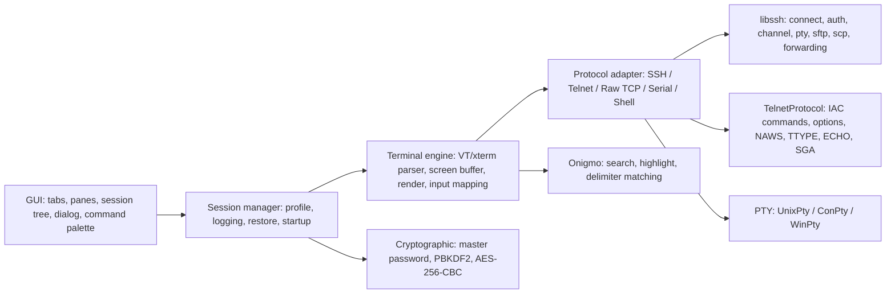
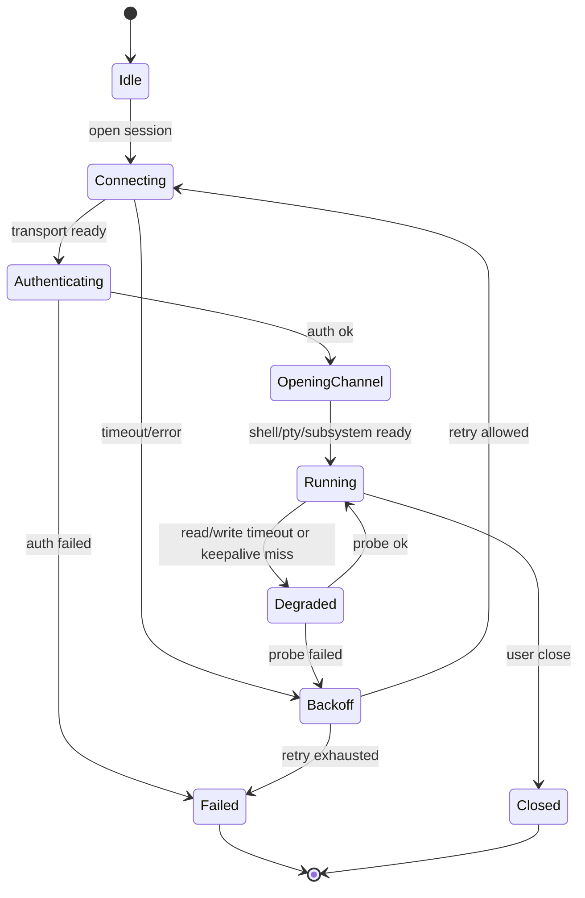

# WindTerm 功能推导

本文基于当前仓库源码与 README 推导 WindTerm 的软件功能、连接逻辑和关键机制。需要特别说明：WindTerm 在 `README.md` 中声明这是一个 **partial open source project**，完整应用层、终端屏幕模型、会话管理 UI、串口/TCP 上层实现等并未全部开源。因此本文把结论分为三类：

- **已由源码验证**：当前仓库可以直接看到实现。
- **由 README/组件能力支撑**：README 明确声明产品支持，或内置库 API 明确具备能力，但具体应用层调用不在开源部分。
- **待验证/缺源码**：产品大概率有该机制，但当前仓库无法确认细节。

## 证据入口

- 产品定位：`README.md:1-2` 定义为 SSH/Telnet/Serial/Shell/Sftp 客户端。
- 开源范围：`README.md:20-24` 与 `src/README.md:1-7` 说明当前仓库只是部分开源。
- 产品功能总表：`README.md:48-113` 覆盖协议、GUI、终端、会话、性能等功能。
- 组件说明：`src/README.md:9-59` 说明 libssh、Onigmo、PTY、Telnet、Cryptographic、Widgets 等组件。

## 总体模块图

## 功能清单

### 协议与连接

| 功能 | 推导结论 | 证据 |
| --- | --- | --- |
| SSH v2 | 支持远程 SSH 会话。连接、认证、channel、pty、shell、exec、subsystem、forwarding 由内置 libssh 支撑。 | `README.md:50-59`, `src/libssh/include/libssh/libssh.h` |
| Telnet | 支持 Telnet。开源部分定义 Telnet 命令、选项、初始协商状态。 | `README.md:51`, `src/Protocols/TelnetProtocol.h`, `src/Protocols/TelnetProtocol.cpp` |
| Raw TCP | README 声明支持 Raw Tcp，但当前仓库没有对应应用层源码。 | `README.md:51` |
| Serial | README 声明支持 Serial，Telnet 选项中也包含 COM-PORT/RSP 常量，但串口会话实现未开源。 | `README.md:51`, `src/Protocols/TelnetProtocol.h` |
| Shell | 支持本地 Shell。Unix 使用 POSIX PTY，Windows 使用 ConPty 或 WinPty。 | `README.md:63-65`, `src/Pty/*` |
| SFTP/SCP | 集成 sftp/scp 客户端，支持上传、下载、删除、重命名、新建文件/目录等。libssh SFTP API 覆盖目录、读写、stat、chmod、chown、symlink、fsync、canonicalize 等。 | `README.md:61`, `src/libssh/include/libssh/sftp.h` |
| Tmux integration | README 声明支持 tmux integration，具体实现未开源。 | `README.md:66` |
| XModem/YModem/ZModem | README 声明支持，当前仓库未见传输协议实现。 | `README.md:60` |

### SSH 连接逻辑

推导链路如下：

1. 创建 `ssh_session`。
2. 设置连接参数：host、port、user、bind address、ssh dir、identity、known_hosts、timeout、compression、proxy command 等。
3. 调用 `ssh_connect()` 建立 TCP/SSH 握手。
4. 检查 known_hosts 状态，未知主机需要用户确认，变更主机密钥必须告警。
5. 按可用方法自动或交互认证：public-key、password、keyboard-interactive、gssapi-with-mic、agent。
6. 建立 session channel。
7. 按用途请求 pty、shell、exec、subsystem(sftp/scp)、X11、agent forwarding、port forwarding。
8. channel 数据进入终端解析/渲染或文件传输层。

关键证据：

- libssh 支持认证方法：`SSH_AUTH_METHOD_PASSWORD`、`SSH_AUTH_METHOD_PUBLICKEY`、`SSH_AUTH_METHOD_INTERACTIVE`、`SSH_AUTH_METHOD_GSSAPI_MIC`。
- libssh 支持 channel 请求：PTY、EXEC、SHELL、SUBSYSTEM、WINDOW_CHANGE、X11。
- libssh 支持 `ssh_channel_request_pty_size()`、`ssh_channel_change_pty_size()`、`ssh_channel_request_shell()`、`ssh_channel_request_exec()`、`ssh_channel_request_subsystem()`、`ssh_channel_request_x11()`、`ssh_channel_request_auth_agent()`。
- `src/README.md:9-11` 说明 WindTerm 的 libssh 基于 0.95 改进，增加 pageant、external socket 和额外 HMAC 算法。

### SSH 认证与 known_hosts

| 能力 | 推导 |
| --- | --- |
| 密码登录 | README 明确支持 auto login with password；libssh 提供 `ssh_userauth_password()`。 |
| 密钥登录 | README 明确支持 public-key；libssh 提供自动公钥、手工导入公私钥、agent 认证能力。 |
| keyboard-interactive | README 明确支持；libssh 文档说明会循环处理服务端 prompt。 |
| gssapi-with-mic | README 明确支持；libssh 认证标志和 config 中有 GSSAPI 设置。 |
| SSH agent | README 明确支持 agent 与 agent forwarding；WindTerm libssh 改进支持 pageant。 |
| known_hosts 校验 | libssh 暴露 known hosts 状态：OK、UNKNOWN、CHANGED、OTHER、NOT_FOUND、ERROR。实际 UI 处理逻辑未开源，但 SSH 客户端需要基于这些状态决定继续、写入或拒绝。 |
| StrictHostKeyChecking | libssh option 支持 strict host key check，并可从 OpenSSH config 解析。 |

### SSH 代理、跳板与转发

| 能力 | 推导 |
| --- | --- |
| ProxyCommand / ProxyJump | README 明确支持；libssh config 支持 `ProxyCommand`。README 的 ProxyJump 可能由上层转换为 ProxyCommand 或多跳链路，具体代码未开源。 |
| ControlMaster | README 明确支持，当前仓库无上层实现。可能是共享 SSH 连接或复用通道。 |
| HTTP/SOCKS5 proxy | README 明确支持，当前开源部分没有代理客户端实现。 |
| Jump Server proxy | README 明确支持，当前开源部分没有跳板 UI/链路实现。 |
| 本地/远程/动态端口转发 | README 明确支持；libssh 支持 direct-tcpip、forwarded-tcpip、tcpip-forward。动态 SOCKS 转发应由上层实现 SOCKS 入口并映射 direct-tcpip。 |
| X11 forwarding | README 明确支持；libssh 提供 X11 channel/request API。 |
| Agent forwarding | README 明确支持；libssh 提供 auth-agent request。 |

### 心跳、超时、断线与重试

| 机制 | 当前推导 |
| --- | --- |
| 连接超时 | libssh `SSH_OPTIONS_TIMEOUT` / `SSH_OPTIONS_TIMEOUT_USEC` 支持连接与 packet 处理超时。`ssh_connect()` 中默认可落到 10 秒实际超时。 |
| SSH keepalive | libssh 提供 `ssh_send_keepalive()`，内部发送 `keepalive@openssh.com` global request。 |
| channel 读超时 | libssh 提供 `ssh_channel_read_timeout()`、`ssh_channel_poll_timeout()`、`ssh_select()`/event poll。 |
| Telnet heartbeat | Telnet 常量包含 `TELOPT_PRAGMA_HEARTBEAT`，但当前只看到选项名映射，未见发送/检测逻辑。 |
| 断线检测 | SSH/Telnet/TCP/SFTP 都可通过 socket/channel read/write error、EOF、timeout、keepalive 失败检测；具体 WindTerm 上层状态机未开源。 |
| 自动重试/断线重连 | README 没有明确列出“断线重连”，当前仓库也没有重连状态机源码。只能推导需要重建底层连接、重新认证、重新申请 PTY/terminal size、恢复 shell 或 SFTP 工作目录；是否已实现、退避策略、最大次数、是否恢复命令不可确认。 |

建议把重连状态机设计为：

### 本地 Shell / PTY

`Pty` 是抽象基类，提供 `createProcess()`、`readAll()`、`write()`、`resizeWindow()`、`readyRead`、`errorOccurred`。当前实现：

| 平台 | 实现 | 连接逻辑 |
| --- | --- | --- |
| Unix/macOS | `UnixPty` | `posix_openpt()` 打开 master；`ptsname()` 获取 slave；`grantpt()`/`unlockpt()`；打开 slave；master 非阻塞；设置 `FD_CLOEXEC`；设置 termios；`QSocketNotifier` 监听 master；`QProcess` 启动 shell；`dup2()` 将 stdin/stdout/stderr 指向 slave；`setsid()`、`TIOCSCTTY`、`tcsetpgrp()` 设置控制终端；写入 utmpx。 |
| Windows 10 1809+ | `ConPty` | `CreatePipe()` 建管道；`CreatePseudoConsole()` 创建 HPCON；`STARTUPINFOEX` 注入 pseudo console；`CreateProcess()` 启动命令；独立 `PipeThread` 读管道；`WriteFile()` 写入。 |
| Windows fallback | `WinPty` | 依赖 `winpty-agent.exe` 与 `winpty.dll`；创建 winpty；连接 conin/conout 本地 socket；配置初始尺寸和鼠标模式；`winpty_spawn()` 启动进程。 |

重要细节：

- Unix PTY 合并 stdout/stderr，master 读取采用 2048 字节缓冲，并对 `EAGAIN` yield 后继续。
- Unix termios 打开 `IXON`、`IUTF8`、`ECHO`，macOS 特设 `VDSUSP`/`VSTATUS`。
- Windows WinPty 打开 `WINPTY_MOUSE_MODE_AUTO`。
- 退出清理：Unix 先 terminate，1 秒后仍未退出则 kill；WinPty/ConPty 关闭 handle/socket/pipe/thread。

### resize 同步终端尺寸

| 场景 | 实现/推导 |
| --- | --- |
| 本地 Unix shell | `UnixPty::resizeWindow()` 同时对 master 和 slave 调 `ioctl(TIOCSWINSZ)`。 |
| Windows ConPty | `ResizePseudoConsole()` 调整 `{columns, rows}`。 |
| Windows WinPty | `winpty_set_size()` 调整列/行。 |
| SSH 远程 shell | libssh 提供 `ssh_channel_change_pty_size(channel, cols, rows)`；窗口变化后应由上层调用。 |
| Telnet | Telnet NAWS 选项用于窗口大小协商；`TelnetProtocol` 初始请求 NAWS。 |

注意：当前 `ConPty::resizeWindow()` 里成功后赋值方向看起来像写反了，代码是 `rows = m_rows; columns = m_columns;`，不像更新成员变量。这属于源码风险点，但不影响本文功能推导。

### Telnet 连接与协商

当前开源部分没有完整 socket 状态机，但有 Telnet 协议基础：

- 命令：EOF/SUSP/ABORT/EOR/SE/NOP/DM/BREAK/IP/AO/AYT/EC/EL/GA/SB/WILL/WONT/DO/DONT/IAC。
- 选项：BINARY、ECHO、SGA、TTYPE、NAWS、TSPEED、LFLOW、LINEMODE、CHARSET、COM PORT OPTION、STARTTLS、MCCP、MSP/MXP、PRAGMA_HEARTBEAT 等。
- 初始协商状态：客户端请求 NAWS、TTYPE；服务端请求 ECHO、SGA；客户端请求 SGA；BINARY 默认 inactive。
- 特殊动作枚举：Abort Process、Abort Output、Are You There、Break、Erase Character、Erase Line、EOF、EOL、EOR、Go Ahead、Interrupt Process、NOP、Suspend。

推导的 Telnet session 流程：

1. 建立 TCP 连接。
2. 初始化 Telnet option state。
3. 处理 IAC 命令流：普通字节进入终端渲染；IAC 后按 WILL/WONT/DO/DONT/SB/SE 进入协商。
4. 根据协商启用 NAWS、TTYPE、ECHO、SGA、BINARY 等。
5. 窗口变化时如 NAWS active，发送列/行。
6. 用户特殊动作可映射为 Telnet command，例如 Ctrl+C 可按终端模式发送 `0x03`，也可能按 UI 命令发送 Telnet IP，具体上层未开源。

### Serial 连接逻辑

README 声明支持 Serial，当前仓库没有串口类。按终端客户端常规架构推导应包含：

- 串口参数：port、baud rate、data bits、parity、stop bits、flow control。
- 打开串口后双向字节流接入同一终端输入/输出管线。
- resize 对真实串口没有远端 PTY 语义，通常只影响本地终端渲染列/行，不会像 SSH/Telnet 那样发送窗口大小。
- 如果支持 Telnet RFC 2217，则 `TELOPT_COM_PORT_OPTION` 和 `TELOPT_RSP` 常量可用于远程串口协商；当前未见实现。

### 终端渲染、ANSI/VT 与输入

README 声明：

- 支持 vt100、vt220、vt340、vt420、vt520、xterm、xterm-256-colors。
- 支持 Unicode、emoji、true-color、mouse protocol、auto wrap。
- vttest 除 Tektronix 4014 外通过。

当前仓库没有完整终端解析器源码，所以 ANSI/CSI/OSC/DCS、scrollback、屏幕缓冲、光标状态机、宽字符布局等不能逐行验证。但从声明可推导具备：

| 能力 | 说明 |
| --- | --- |
| ANSI 转义字符渲染 | 需要支持 SGR 颜色/样式、光标移动、清屏、滚动区域、备用屏幕、tab stop、字符集、OSC title/clipboard 等 xterm 常见能力。 |
| 256 色与 true-color | `xterm-256-colors` 和 true-color 说明支持 8/16/256 色与 24-bit RGB。 |
| 鼠标协议 | 支持 xterm mouse tracking，需把鼠标事件编码回远端。 |
| 自动换行 | README 明确支持 auto wrap mode。 |
| vttest | 表明 VT 状态机覆盖面较广。 |

### 特殊按键

上层键盘映射源码未开源，但终端客户端必须把 GUI 键事件转换为字节序列：

| 按键 | 本地/远程 Shell 常见发送 |
| --- | --- |
| 上/下/右/左 | 普通模式 `ESC [ A/B/C/D`，应用光标模式 `ESC O A/B/C/D`。 |
| Tab | `0x09`。 |
| Enter | CR 或 CRLF，取决于协议/终端模式。 |
| Backspace | `0x7f` 或 `0x08`，取决于配置。 |
| Ctrl+C | `0x03`，通常触发 SIGINT；Telnet 也可用 IP command。 |
| Ctrl+D | `0x04`，通常表示 EOF。 |
| Ctrl+Z | `0x1a`，Unix 下 suspend；Telnet 也有 SUSP action。 |
| Alt/Meta | 通常发送 ESC 前缀。 |
| 功能键 | xterm/VT 对应 CSI/SS3 序列。 |

PTY 层只负责字节读写：`write()` 把映射后的字节写到 master/socket/channel，`readAll()` 把子进程或远端输出交给终端解析器。

### 中文编码、宽字符、emoji 宽度

README 声明支持 Unicode 13、Unicode、emoji。源码中 Onigmo 支持多编码正则，包括 UTF-8/UTF-16/UTF-32、EUC-JP、SJIS、GB18030、Big5 等，用于搜索/匹配而非终端解码主链路。

推导：

- 终端主链路至少需要 UTF-8 解码，并正确处理 combining marks、East Asian Wide/Fullwidth、ambiguous width、emoji ZWJ 序列、variation selector。
- 中文字符通常宽度 2；普通 ASCII 宽度 1；combining mark 宽度 0；emoji 宽度通常 2，但不同 Unicode 版本和系统字体会有差异。
- README 的 Unicode 13 意味着宽度表/字符分类大概率按 Unicode 13 数据生成或内置。
- 当前仓库没有 `wcwidth` 或终端 cell 布局源码，无法确认 ambiguous width 策略、emoji ZWJ 合成策略、GBK/Big5 等非 UTF-8 session 编码转换策略。

### SFTP/SCP 文件传输

README 声明集成 SFTP/SCP 和本地文件管理器。libssh `sftp.h` 可支撑：

- `sftp_new()` / `sftp_init()` / `sftp_free()` 建立/释放 SFTP session。
- 目录：`sftp_opendir()`、`sftp_readdir()`、`sftp_closedir()`。
- 文件属性：`sftp_stat()`、`sftp_lstat()`、`sftp_fstat()`、`sftp_attributes_free()`。
- 文件读写：`sftp_open()`、`sftp_read()`、`sftp_write()`、`sftp_close()`，以及 async read。
- 偏移：`sftp_seek()`、`sftp_seek64()`、`sftp_tell()`、`sftp_tell64()`、`sftp_rewind()`。
- 修改：`sftp_unlink()`、`sftp_rmdir()`、`sftp_mkdir()`、`sftp_rename()`、`sftp_setstat()`、`sftp_chown()`、`sftp_chmod()`、`sftp_utimes()`。
- 链接与文件系统：`sftp_symlink()`、`sftp_readlink()`、`sftp_statvfs()`、`sftp_fstatvfs()`、`sftp_fsync()`、`sftp_canonicalize_path()`。
- SCP：libssh doc/API 支持递归读写、push file/directory、pull request。

高层功能推导：

- 上传：本地 open/read -> `sftp_open(O_WRONLY|O_CREAT|...)` -> `sftp_write()` 分块 -> close。
- 下载：`sftp_open(O_RDONLY)` -> `sftp_read()` 分块 -> 本地 write。
- 删除/重命名/新建：直接映射到对应 SFTP API。
- 断点续传：SFTP API 支持 seek/tell，但 README 未明确声明；是否实现待验证。
- 高速传输：README benchmark 提到 high speed transfer，但具体策略未开源，可能包括并发 pipeline、异步读取、较大窗口/块大小等。

### 安全与本地敏感数据保护

`Cryptographic` 用于保护用户数据，`src/README.md:29-31` 明确包括密码、私钥等：

- PBKDF2：`QPasswordDigestor::deriveKeyPbkdf2(QCryptographicHash::Sha3_512, password, salt, 100000, 48)`。
- key/iv：前 32 字节为 AES-256 key，后 16 字节为 IV。
- 加解密：OpenSSL EVP AES-256-CBC。
- 输出：密文 Base64。
- salt：系统随机 64-bit 数字经 SHA-512 后 Base64。

风险备注：AES-CBC 未见认证标签/HMAC，当前开源类本身不提供篡改检测；上层是否另有完整性校验未知。

### GUI 与会话功能

README 声明以下 GUI/会话能力，当前多数应用层源码未开源：

- 跨平台 Windows/macOS/Linux、多语言 UI。
- Session dialog、session tree。
- Auto Completion、Free Type Mode、Focus Mode、Sync Input。
- 用户名/密码增强保护。
- Command palette、Command sender、Explorer Pane、Shell Pane、Quick Bar、Paste Dialog。
- 本地/远程模式与 vim keybindings。
- 时间戳、折叠、大纲、分屏。
- Powerline 支持。
- VS Code 风格 color scheme。
- 搜索、预览、括号/自定义分隔符高亮。
- UI theme、tab color、tab 搜索、关闭右侧 tabs、窗口透明。
- 选中复制、右键/中键粘贴。
- 在线搜索 Google/Bing/GitHub/StackOverflow/Wikipedia/DuckDuckGo。
- 输入时隐藏鼠标、锁屏。
- HTTP/SOCKS5 proxy、Jump Server proxy。
- 手动/自动 session logging。
- rename/duplicate session。
- 重启恢复上次 sessions/layouts。
- 启动时打开指定 session 或 session set。

### 性能机制

README 声明：

- 动态内存压缩，可减少约 20% 到 90% working memory。
- 高性能、低内存、低延迟。
- SFTP 和终端性能 benchmark 显示 unlimited scrollback 场景下低内存表现。

当前仓库可见的性能相关基础设施：

- `CircularBuffer`：快速环形缓冲。
- `Spin`：高性能自旋锁。
- `ThreadLocal`：线程本地存储。
- `ScrollBar`：支持 64-bit range，暗示可承载大量 scrollback。
- `Onigmo` iterator 改造：支持 gap buffer 或非连续内存块匹配，适合大文本/终端缓冲搜索。

终端动态内存压缩的实际数据结构未开源，无法确认压缩粒度、触发策略、随机访问成本。

## 待验证点清单

以下能力 README 声明或产品上合理需要，但当前仓库没有完整上层实现，后续若拿到闭源/完整代码可优先检查：

- SSH/Telnet/Raw TCP/Serial 的统一 session state machine。
- 断线重连策略：是否自动重连、最大次数、退避、是否保持 tab、是否恢复工作目录/命令。
- SSH keepalive 的 UI 配置、间隔、失败阈值。
- Telnet IAC parser 与 NAWS/TTYPE/ECHO/SGA 真实协商状态机。
- Serial 端口枚举、参数配置、流控、RFC2217。
- Raw TCP 连接、编码、换行策略。
- ANSI/VT parser、OSC/DCS 支持范围、颜色与字体渲染。
- 键盘映射配置，尤其 Backspace/Delete、Alt、应用光标键、功能键、Ctrl/Meta 组合。
- Unicode 宽度表、emoji ZWJ、ambiguous width、非 UTF-8 编码转换。
- SFTP 高速传输、并发、断点续传、冲突处理、权限/时间戳保留。
- session logging 的文件格式、轮转、敏感信息脱敏。
- master password 派生 key 的保存、salt 存储、密文完整性校验。

## 快速索引：用户关心点

1. **伪终端 PTY**：已由 `src/Pty` 源码验证。Unix 使用 POSIX PTY；Windows 使用 ConPty/WinPty。
2. **ANSI 转义字符渲染**：README 明确支持 VT/xterm/vttest，但解析器源码未开源。
3. **上下左右、Tab、Ctrl+C、Ctrl+D**：终端客户端必备，README 的 VT/xterm 支持可支撑；键盘映射源码未开源。
4. **中文编码、宽字符、emoji 宽度**：README 明确 Unicode 13/emoji；宽度表和编码转换策略未开源。
5. **窗口 resize 同步终端尺寸**：PTY 层已验证；SSH 可由 libssh `window-change` 支撑；Telnet 可由 NAWS 支撑。
6. **断线重连、心跳、超时**：libssh 有 timeout/keepalive；Telnet 有 heartbeat 常量；自动重连策略未见源码。
7. **密钥登录、密码登录、known_hosts 校验**：README 与 libssh 均支持，UI 决策逻辑未开源。

## Flutter + Rust 重写版设计索引

基于以上推导，新的跨平台 SSH 工具建议不复用 WindTerm 旧代码，而是复用其产品逻辑和功能边界，采用 Flutter 负责 UI、Rust 负责协议与终端核心的架构。后续设计拆分如下：

- [新项目产品需求与里程碑](new-project-requirements.md)：按阶段定义 MVP、Alpha、Beta、稳定版。
- [Flutter + Rust 架构设计](flutter-rust-architecture.md)：模块划分、进程内架构、数据流、线程模型。
- [协议与终端核心设计](protocol-terminal-core.md)：SSH/Telnet/Serial/Shell/SFTP、PTY、ANSI、resize、重连状态机。
- [安全模型](security-model.md)：凭据、known_hosts、密钥、主密码、审计与漏洞规避。
- [FFI 接口草案](ffi-api-draft.md)：Dart 与 Rust core 的边界、事件、命令、错误模型。
- [Flutter UI 与 Rust Core 技术选型](technology-selection.md)：Flutter UI 技术栈、Rust 库选型、FFI/FRB 交互方式、技术 spike。
