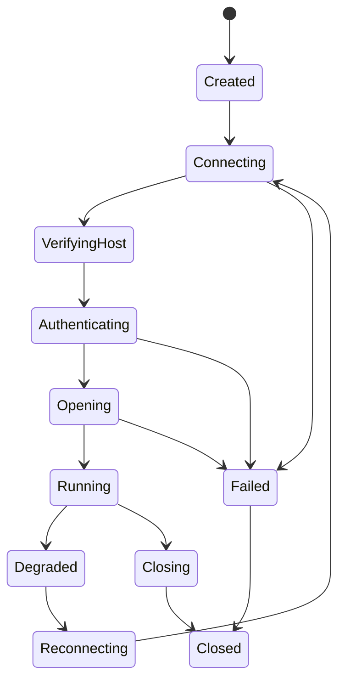
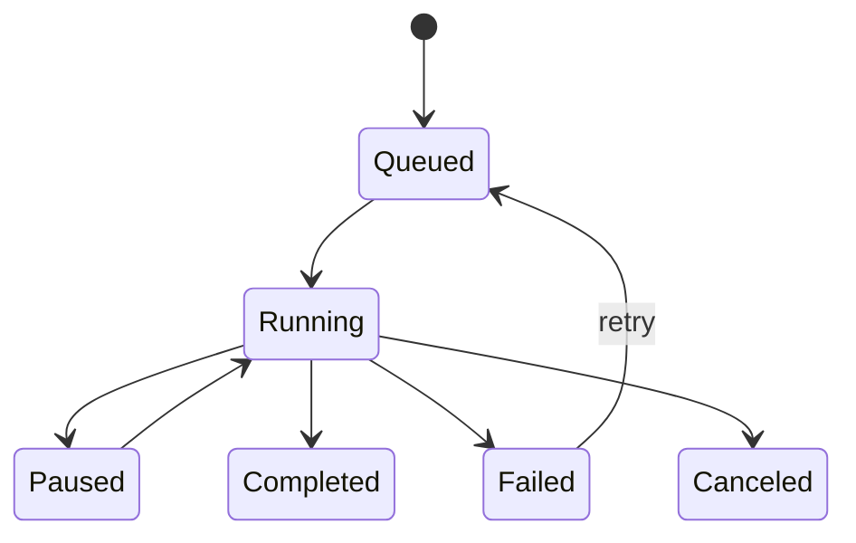

# 协议与终端核心设计

## Core 抽象

所有连接类型统一为 `Session`：

```text
Session
- id
- kind: ssh | local_shell | telnet | raw_tcp | serial | sftp
- state
- terminal
- transport
- reconnect_policy
- metrics
```

统一状态：



## SSH Session

### 连接流程

1. 解析 profile。
2. 建立 TCP 或 proxy transport。
3. SSH handshake。
4. host key 校验。
5. 认证。
6. 打开 channel。
7. 请求 remote PTY。
8. 请求 shell 或 exec。
9. channel data 接入 terminal engine。

### 认证策略

支持顺序：

1. none probe，用于获取服务端 method list。
2. public key with agent。
3. configured private key。
4. password。
5. keyboard-interactive。
6. gssapi-with-mic 后续阶段加入。

认证错误需要可区分：

- 网络错误。
- host key 错误。
- 用户取消。
- 凭据错误。
- 私钥 passphrase 错误。
- 服务端拒绝。
- 方法不支持。

### known_hosts

状态：

- `Ok`：允许。
- `Unknown`：弹窗展示 fingerprint，用户确认后写入。
- `Changed`：默认阻止，要求显式覆盖。
- `OtherAlgorithm`：提示存在其他算法记录，默认阻止。
- `NotFound`：等同 unknown，但需要创建文件。
- `Error`：阻止连接。

fingerprint 至少支持：

- SHA256 Base64，OpenSSH 风格。
- MD5 hex 可选，仅兼容展示。

### resize

SSH running 后 Flutter 发 `Resize(cols, rows)`：

- terminal viewport 更新。
- SSH channel 发送 window-change。
- 本地记录最后成功尺寸。
- 重连后用最后尺寸重新 request PTY。

## Local Shell

平台：

- macOS/Linux：PTY。
- Windows：ConPTY。

流程：

1. 选择 shell command。
2. 创建 PTY，设置初始 rows/cols。
3. 设置 working directory 与 environment。
4. 子进程 stdin/stdout/stderr 接 PTY。
5. PTY output 接 terminal engine。
6. Flutter 输入写 PTY。

## Telnet

Telnet parser 独立于 terminal parser：

```text
TCP bytes
  -> Telnet IAC parser
      -> Telnet negotiation events
      -> Plain terminal bytes
  -> Terminal engine
```

必须实现：

- IAC 转义。
- WILL/WONT/DO/DONT。
- SB/SE 子协商。
- NAWS。
- TTYPE。
- ECHO。
- SGA。
- BINARY。

后续：

- CHARSET。
- COM PORT OPTION/RFC2217。
- PRAGMA_HEARTBEAT。

## Serial

串口 session 不需要网络认证：

1. 枚举端口。
2. 打开端口。
3. 设置 baud rate、data bits、parity、stop bits、flow control。
4. 读写字节流。
5. 接 terminal engine。

Serial 特有设置：

- 自动重连设备。
- DTR/RTS 控制。
- 十六进制显示模式后续加入。
- 换行发送模式：CR、LF、CRLF。

## SFTP

SFTP 不直接绑定 terminal grid。

Task 类型：

- list directory。
- stat。
- upload。
- download。
- remove。
- rename。
- mkdir。
- chmod/chown。
- cancel。

传输任务状态：



## Terminal Engine

### 输入

输入分两层：

- Flutter 捕获物理键、文本输入、IME、鼠标。
- Rust input mapper 根据 terminal mode 转成字节。

需要支持：

- 普通文本。
- Ctrl/Alt/Meta。
- 方向键普通/应用模式。
- function keys。
- bracketed paste。
- mouse protocol。
- composition/IME。

### 输出

终端输出管线：

```text
bytes -> decoder -> VT parser -> terminal grid -> dirty ranges -> Flutter
```

decoder：

- 默认 UTF-8。
- 后续支持 GB18030、Big5、Shift-JIS 等 profile encoding。

grid：

- primary screen。
- alternate screen。
- scrollback。
- cursor。
- selection anchors。
- tab stops。
- modes。

宽度：

- ASCII width 1。
- CJK width 2。
- combining mark width 0。
- emoji 默认 width 2。
- ZWJ sequence 以 grapheme cluster 为单位。
- ambiguous width 作为 profile 设置。

## 重连策略

重连必须保守：

- 用户主动断开不重连。
- host key changed 不重连。
- auth failed 不重连。
- 网络错误、timeout、keepalive 失败可重连。

策略字段：

```text
enabled
max_attempts
initial_delay_ms
max_delay_ms
backoff_factor
jitter
keep_tab_open
restore_pty_size
run_reconnect_script
```

默认建议：

- Phase 1 只做手动重连。
- Phase 5 再做自动重连。

## 心跳与超时

SSH：

- TCP connect timeout。
- SSH handshake timeout。
- auth timeout。
- channel idle timeout 可选。
- keepalive interval。
- keepalive max misses。

Telnet/Raw TCP：

- TCP keepalive 可选。
- 应用层 heartbeat 只在协议支持时启用。

Serial：

- 无心跳。
- 设备断开由 read/write error 或平台事件发现。

