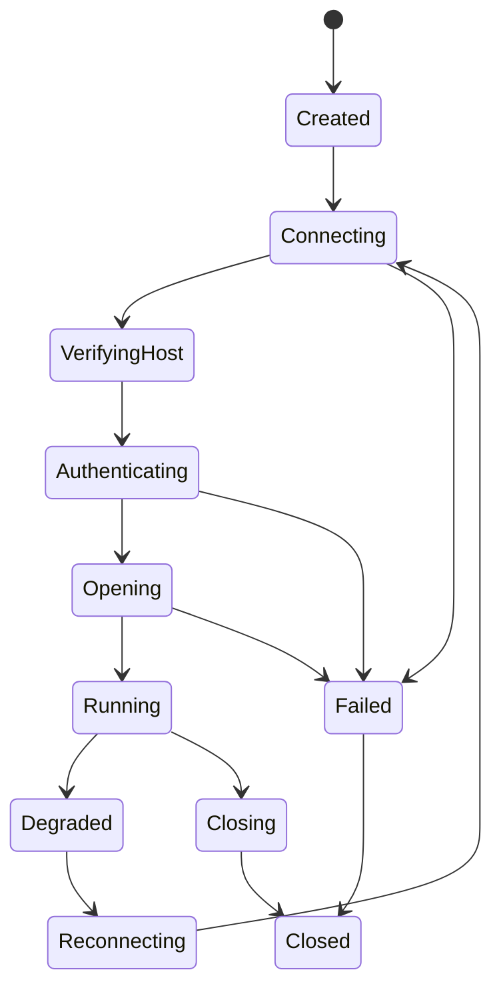
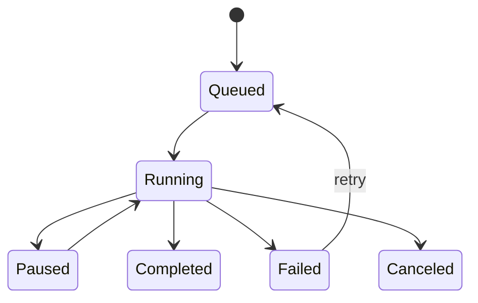

# 协议与终端核心设计

## Core 抽象

所有连接类型统一为 `Session`：

```text
Session
- id
- kind: ssh | local_shell | telnet | raw_tcp | serial | sftp
- state
- terminal
- transport
- reconnect_policy
- metrics
```

统一状态：



## SSH Session

### 连接流程

1. 解析 profile。
2. 建立 TCP 或 proxy transport。
3. SSH handshake。
4. host key 校验。
5. 认证。
6. 打开 channel。
7. 请求 remote PTY。
8. 请求 shell 或 exec。
9. channel data 接入 terminal engine。

### 认证策略

支持顺序：

1. none probe，用于获取服务端 method list。
2. public key with agent。
3. configured private key。
4. password。
5. keyboard-interactive。
6. gssapi-with-mic 后续阶段加入。

认证错误需要可区分：

- 网络错误。
- host key 错误。
- 用户取消。
- 凭据错误。
- 私钥 passphrase 错误。
- 服务端拒绝。
- 方法不支持。

### 密钥协商策略

SSH 握手阶段客户端与服务端协商四类算法，按优先级排列。

#### KEX（密钥交换）

优先使用 ECDH 和 Curve25519，保留 DH Group Exchange 作为兼容回退：

| 优先级 | 算法 | 说明 |
| --- | --- | --- |
| 1 | curve25519-sha256 | 默认首选，无需协商 group，抗时序攻击。 |
| 2 | curve25519-sha256@libssh.org | 旧版 OpenSSH 兼容。 |
| 3 | ecdh-sha2-nistp256 | 广泛支持，NIST P-256。 |
| 4 | ecdh-sha2-nistp384 | NIST P-384。 |
| 5 | ecdh-sha2-nistp521 | NIST P-521。 |
| 6 | diffie-hellman-group16-sha512 | 4096-bit DH，兼容不支持 ECDH 的旧服务端。 |
| 7 | diffie-hellman-group14-sha256 | 2048-bit DH，最低兼容线。 |

禁用：

- `diffie-hellman-group1-sha1`（1024-bit，SHA-1）。
- `diffie-hellman-group-exchange-sha1`（SHA-1）。
- 所有基于 SHA-1 的 KEX。

#### Host Key 算法

优先 Ed25519，RSA 使用 SHA-2 签名：

| 优先级 | 算法 | 说明 |
| --- | --- | --- |
| 1 | ssh-ed25519 | 默认首选，签名小，验证快。 |
| 2 | ecdsa-sha2-nistp256 | 广泛部署。 |
| 3 | ecdsa-sha2-nistp384 | 次选 ECDSA。 |
| 4 | ecdsa-sha2-nistp521 | 次选 ECDSA。 |
| 5 | rsa-sha2-512 | RSA 使用 SHA-512 签名。 |
| 6 | rsa-sha2-256 | RSA 使用 SHA-256 签名。 |

禁用：

- `ssh-dss`（DSA，1024-bit 上限，SHA-1）。
- `ssh-rsa`（SHA-1 签名）。

#### 对称加密（Cipher）

优先 AEAD 模式，避免 CBC：

| 优先级 | 算法 | 模式 | 说明 |
| --- | --- | --- | --- |
| 1 | chacha20-poly1305@openssh.com | AEAD | 软件实现性能优秀，无 padding oracle 风险。 |
| 2 | aes256-gcm@openssh.com | AEAD | 硬件 AES-NI 加速。 |
| 3 | aes128-gcm@openssh.com | AEAD | 同上，密钥较短。 |
| 4 | aes256-ctr | CTR | 兼容回退，无 AEAD 需配合 HMAC。 |
| 5 | aes192-ctr | CTR | 同上。 |
| 6 | aes128-ctr | CTR | 同上。 |

禁用：

- 所有 CBC 模式（`aes256-cbc`、`aes128-cbc` 等）。
- 所有 RC4（`arcfour`）。
- 所有 3DES（`3des-cbc`）。
- `none` cipher。

#### MAC（消息认证码）

AEAD cipher 不需要 MAC；CTR/CBC cipher 必须配合 MAC：

| 优先级 | 算法 | 说明 |
| --- | --- | --- |
| 1 | hmac-sha2-256-etm@openssh.com | ETM 模式，先加密后 MAC。 |
| 2 | hmac-sha2-512-etm@openssh.com | ETM 模式。 |
| 3 | hmac-sha2-256 | Encrypt-then-MAC 不可用时的回退。 |
| 4 | hmac-sha2-512 | 同上。 |

禁用：

- `hmac-sha1`、`hmac-sha1-96`（SHA-1）。
- `hmac-md5`、`hmac-md5-96`（MD5）。
- 所有 `*-96` 截断变体。
- `umac-64@openssh.com`（64-bit tag 太短）。

#### 压缩

默认禁用压缩，除非用户明确开启：

| 策略 | 说明 |
| --- | --- |
| 默认 | `none`。终端流量小，压缩收益低，且增加时序侧信道风险。 |
| 用户开启 | `zlib@openssh.com`（OpenSSH 专有延迟压缩）。 |
| 禁用 | `zlib`（RFC 4253，全程压缩，安全风险更高）。 |

#### 算法降级与用户覆盖

- 默认策略硬编码在 Rust core 中，不暴露为用户 UI 配置。
- 高级用户可通过 profile 的 `kex_override` 字段覆盖算法列表，用于兼容特殊服务端。
- 连接日志记录协商结果：最终选定的 KEX、host key、cipher、MAC、compression 算法。
- 如果服务端仅提供被禁用的算法，连接失败并提示具体原因（如"服务端仅支持 SHA-1 KEX，已被安全策略禁用"），不自动降级。

### known_hosts

状态：

- `Ok`：允许。
- `Unknown`：弹窗展示 fingerprint，用户确认后写入。
- `Changed`：默认阻止，要求显式覆盖。
- `OtherAlgorithm`：提示存在其他算法记录，默认阻止。
- `NotFound`：等同 unknown，但需要创建文件。
- `Error`：阻止连接。

fingerprint 至少支持：

- SHA256 Base64，OpenSSH 风格。
- MD5 hex 可选，仅兼容展示。

### resize

SSH running 后 Flutter 发 `Resize(cols, rows)`：

- terminal viewport 更新。
- SSH channel 发送 window-change。
- 本地记录最后成功尺寸。
- 重连后用最后尺寸重新 request PTY。

## Local Shell

平台：

- macOS/Linux：PTY。
- Windows：ConPTY。

流程：

1. 选择 shell command。
2. 创建 PTY，设置初始 rows/cols。
3. 设置 working directory 与 environment。
4. 子进程 stdin/stdout/stderr 接 PTY。
5. PTY output 接 terminal engine。
6. Flutter 输入写 PTY。

## Telnet

Telnet parser 独立于 terminal parser：

```text
TCP bytes
  -> Telnet IAC parser
      -> Telnet negotiation events
      -> Plain terminal bytes
  -> Terminal engine
```

必须实现：

- IAC 转义。
- WILL/WONT/DO/DONT。
- SB/SE 子协商。
- NAWS。
- TTYPE。
- ECHO。
- SGA。
- BINARY。

后续：

- CHARSET。
- COM PORT OPTION/RFC2217。
- PRAGMA_HEARTBEAT。

## Serial

串口 session 不需要网络认证：

1. 枚举端口。
2. 打开端口。
3. 设置 baud rate、data bits、parity、stop bits、flow control。
4. 读写字节流。
5. 接 terminal engine。

Serial 特有设置：

- 自动重连设备。
- DTR/RTS 控制。
- 十六进制显示模式后续加入。
- 换行发送模式：CR、LF、CRLF。

## SFTP

SFTP 不直接绑定 terminal grid。

Task 类型：

- list directory。
- stat。
- upload。
- download。
- remove。
- rename。
- mkdir。
- chmod/chown。
- cancel。

传输任务状态：



## Terminal Engine

### 输入

输入分两层：

- Flutter 捕获物理键、文本输入、IME、鼠标。
- Rust input mapper 根据 terminal mode 转成字节。

需要支持：

- 普通文本。
- Ctrl/Alt/Meta。
- 方向键普通/应用模式。
- function keys。
- bracketed paste。
- mouse protocol。
- composition/IME。

### 输出

终端输出管线：

```text
bytes -> decoder -> VT parser -> terminal grid -> dirty ranges -> Flutter
```

decoder：

- 默认 UTF-8。
- 后续支持 GB18030、Big5、Shift-JIS 等 profile encoding。

grid：

- primary screen。
- alternate screen。
- scrollback。
- cursor。
- selection anchors。
- tab stops。
- modes。

宽度：

- ASCII width 1。
- CJK width 2。
- combining mark width 0。
- emoji 默认 width 2。
- ZWJ sequence 以 grapheme cluster 为单位。
- ambiguous width 作为 profile 设置。

## 重连策略

重连必须保守：

- 用户主动断开不重连。
- host key changed 不重连。
- auth failed 不重连。
- 网络错误、timeout、keepalive 失败可重连。

策略字段：

```text
enabled
max_attempts
initial_delay_ms
max_delay_ms
backoff_factor
jitter
keep_tab_open
restore_pty_size
run_reconnect_script
```

默认建议：

- Phase 1 只做手动重连。
- Phase 5 再做自动重连。

## 心跳与超时

SSH：

- TCP connect timeout。
- SSH handshake timeout。
- auth timeout。
- channel idle timeout 可选。
- keepalive interval。
- keepalive max misses。

Telnet/Raw TCP：

- TCP keepalive 可选。
- 应用层 heartbeat 只在协议支持时启用。

Serial：

- 无心跳。
- 设备断开由 read/write error 或平台事件发现。

